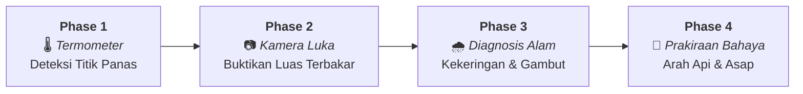

# 🛰️ Cerita Detektif Satelit: Memantau Kebakaran Hutan & Lahan Kalimantan dari Luar Angkasa
## Panduan Ringkas & Penjelasan Temuan Phase 1 s/d Phase 4 untuk Masyarakat Umum

**Sistem Pemantauan:** *Kalimantan Fire Situation Monitor*  
**Periode Analisis:** 13 – 20 Agustus 2026 (Puncak Musim Kemarau)  
**Wilayah Pantau:** Seluruh Pulau Kalimantan (5 Provinsi & 48 Kabupaten/Kota Aktif)  
**Status Laporan:** Lengkap (Phase 1, Phase 2, Phase 3, dan Phase 4)

---

## 🌟 Pengantar: Bagaimana Satelit Bekerja Menjadi "Detektif Lingkungan"?

Ketika musim kemarau melanda Kalimantan, kita sering mendengar berita tentang "ribuan titik panas" atau "kabut asap tebal". Namun, bagaimana para ilmuwan dan pemerintah memantau apa yang sebenarnya terjadi dari ketinggian ratusan kilometer di luar angkasa?

Sistem pemantauan ini bekerja seperti **tim dokter dan detektif lingkungan** yang melakukan 4 langkah pemeriksaan berurutan:



---

## 📍 Phase 1 — "Termometer dari Luar Angkasa" (Deteksi Titik Panas)

* **Pertanyaan Utama:** *Di mana saja bagian bumi Kalimantan yang suhunya terasa panas tidak wajar?*
* **Sensor yang Digunakan:** Satelit NASA VIIRS (SNPP & NOAA-20) yang mengukur radiasi inframerah termal setiap hari.

### 🔍 Apa Temuannya?
1. **Kalimantan Sedang Mengalami "Demam Tinggi":**
   * Dalam jendela 7 hari pengamatan, satelit mendeteksi **153.251 sinyal anomali panas**.
   * Pada jendela 24 jam terakhir (20 Agustus 2026), tercatat **4.888 titik panas operasional** dengan tingkat keyakinan tinggi.
2. **Dua Wilayah Paling Bergejolak:**
   * **Kalimantan Barat (2.553 titik / 24 jam):** Mengalami lonjakan titik panas baru yang sangat cepat di Kabupaten Sanggau, Sekadau, Landak, dan Ketapang.
   * **Kalimantan Timur (2.009 titik / 24 jam):** Menjadi episentrum pelepasan energi panas paling dahsyat, terpusat di **Kabupaten Berau** (1.228 titik dalam 24 jam).
3. **Mengelompokkan Titik Panas (*Clustering*):**
   * Titik-titik panas ini tidak berdiri sendiri, melainkan mengumpul menjadi **325 klaster kebakaran besar**.
   * Klaster terbesar terdeteksi di Berau dengan bentangan area panas mencapai $10 \times 13\text{ km}$.

> [!NOTE]
> **Penting Dipahami Orang Awam:**  
> Titik panas (*active-fire detection / hotspot*) adalah **sinyal suhu tinggi**, bukan otomatis kebakaran hutan raksasa. Sinyal ini bisa berasal dari pembukaan lahan pertanian, pembersihan semak, titik industri/pabrik, atau kebakaran vegetasi alami. Oleh karena itu, kita memerlukan Phase 2 untuk melihat bukti fisiknya.

---

## 📷 Phase 2 — "Kamera Pembukti Luka" (Konfirmasi Luas & Keparahan Bekas Terbakar)

* **Pertanyaan Utama:** *Apakah titik panas itu benar-benar membakar vegetasi, berapa luasnya, dan seberapa rusak?*
* **Sensor yang Digunakan:** Satelit optik beresolusi tinggi Eropa (Sentinel-2 L2A resolusi 10–20 meter) dan satelit cadangan Amerika (Landsat 8/9 resolusi 30 meter). Sistem membandingkan pantulan cahaya daun hijau sebelum dan sesudah kebakaran (*Differenced Normalized Burn Ratio* / dNBR).

### 🔍 Apa Temuannya?
1. **Terbukti Terbakar 2.684,27 Hektare:**
   * Pada klaster prioritas yang apinya telah mereda dan bebas dari tutupan awan/asap, satelit mengonfirmasi **2.684,27 hektare luka bakar fisik di permukaan tanah** (setara dengan sekitar 3.700 lapangan sepak bola).
2. **Berau (Kaltim) Mengalami Kerusakan Terparah:**
   * Menyumbang **69,9% (1.875 ha)** dari seluruh lahan terbakar terkonfirmasi di Kalimantan.
   * Di **Kabupaten Berau (Klaster #327)** saja, lahan yang terbakar mencapai **1.727,77 hektare**, dengan **139 hektare kanopi/tajuk hutan hancur total (*High Severity*)** — menyumbang 97,5% kerusakan tajuk tinggi di seluruh Kalimantan.
3. **Beberapa Titik Masih Berkobar (Belum Bisa Diukur Luka Tanahnya):**
   * Di wilayah **Landak, Sekadau, Sanggau (Kalbar)** dan **Bulungan (Kaltara)**, satelit melihat titik api masih sangat aktif dengan pelepasan energi tinggi (FRP > 80 MW). Karena masih diselimuti asap pekat dan api aktif pada 20 Agustus, citra bekas terbakarnya menunggu foto satelit berikutnya. Wilayah ini ditetapkan sebagai **Zona Prioritas Pemadaman Lapangan**.

```
Distribusi Kerusakan Seluruh Area Terbakar Terkonfirmasi (2.684 ha):
🟩 Keparahan Rendah (Semak/Rumput Bawah)        : 1.760,77 ha (65,6%)
🟨 Keparahan Sedang-Rendah (Vegetasi Sedang)   :   446,81 ha (16,6%)
🟧 Keparahan Sedang-Tinggi (Sebagian Tajuk)    :   334,15 ha (12,4%)
🟥 Keparahan Tinggi (Tajuk Hutan Rusak Total)  :   142,54 ha ( 5,3%)
```

---

## 🌧️ Phase 3 — "Diagnosis Lingkungan & Cuaca" (Kekeringan & Gambut)

* **Pertanyaan Utama:** *Mengapa api bisa membesar? Seberapa kering alam di sekitarnya dan apakah mengenai lahan gambut?*
* **Sensor & Data:** Data satelit curah hujan harian 40 tahun (CHIRPS), indeks kekeringan tanah Keetch-Byram (KBDI), suhu permukaan (MODIS LST), dan Peta Lahan Gambut Global.

### 🔍 Apa Temuannya?
1. **Defisit Air & Kekeringan Tanah yang Meluas:**
   * **9 dari 10 klaster kebakaran berada pada status "Tanah Kering" (KBDI 400–600)**. Artinya, lapisan tanah atas dan serasah daun sudah sangat kering dan mudah tersulut.
   * **Kabupaten Ketapang (Kalbar)** mengalami kondisi kemarau paling ekstrem: selama 30 hari hanya menerima hujan **0,1 mm** (anomali curah hujan -99,9%, dengan 29 hari kering tanpa hujan).
   * **Kotawaringin Timur (Kalteng)** mencatat 28 hari kering dengan kekurangan hujan sebesar -90,2%.
2. **Keterkaitan Erat dengan Lahan Gambut:**
   * Dari 2.684,27 ha area terbakar terkonfirmasi, sebanyak **1.057,24 hektare (39,4%) berada di atas tanah gambut**.
   * Di Ketapang (Kalbar) dan Kotawaringin Timur (Kalteng), lebih dari **72,5% area klaster merupakan kubah gambut**. Lahan gambut yang kering menyimpan bahan bakar tebal di bawah permukaan, sehingga api dapat menyusup ke bawah tanah dan mengeluarkan asap pekat dalam waktu lama.

> [!IMPORTANT]
> **Prinsip Non-Kausalitas (Kejujuran Ilmiah):**  
> Data Phase 3 membuktikan adanya **hubungan spasial yang erat** antara lokasi kebakaran, cuaca kering, dan keberadaan gambut. Namun data satelit tidak membuktikan penyebab pasti penyulutan api (apakah faktor kelalaian, kesengajaan, atau kebakaran alami). Penyebab langsung harus diverifikasi lewat investigasi darat.

---

## 🧠 Phase 4 — "Intelijen Bahaya, Arah Api & Sebaran Asap" (Prakiraan Risiko)

* **Pertanyaan Utama:** *Ke mana arah rambatan api selanjutnya, seberapa besar potensi bahayanya, dan ke mana asapnya bertiup?*
* **Metodologi:** Penggabungan seluruh data menjadi Indeks Kerentanan Kebakaran Kalimantan (*Kalimantan Fire Susceptibility Index* / KFSI), pelacakan arah gerak sentroid titik api, dan citra satelit pemantau gas Karbon Monoksida & Aerosol (Sentinel-5P TROPOMI).

### 🔍 Apa Temuannya?

| Peringkat | Klaster & Wilayah | Skor Risiko (0–100) | Tingkat Peringatan Dini | Peluang Tetap Menyala (48 Jam) | Kategori Kerentanan (KFSI) |
|:---:|---|:---:|:---:|:---:|:---:|
| **#1** | **#327 Berau, Kaltim** | **77,1** | 🔴 **Level 4: Critical Emergency** | **88,3% (Ekstrem)** | **Sangat Tinggi (0,964)** |
| **#2** | **#318 Landak, Kalbar** | 51,6 | 🟡 Level 2: Alert (Siaga) | 87,8% (Ekstrem) | Sangat Tinggi (0,957) |
| **#3** | **#58 Ketapang, Kalbar** | 49,4 | 🟡 Level 2: Alert (Siaga) | 74,5% (Tinggi) | Sangat Tinggi (0,880) |
| **#4** | **#16 Kotawaringin Timur, Kalteng** | 48,9 | 🟡 Level 2: Alert (Siaga) | 74,1% (Tinggi) | Sangat Tinggi (0,876) |
| **#5** | **#314 Kutai Timur, Kaltim** | 44,6 | 🟡 Level 2: Alert (Siaga) | 64,0% (Tinggi) | Tinggi (0,751) |
| **#6** | **#299 Sekadau, Kalbar** | 42,8 | 🟡 Level 2: Alert (Siaga) | 64,7% (Tinggi) | Tinggi (0,768) |
| **#7** | **#243 Sanggau, Kalbar** | 42,2 | 🟡 Level 2: Alert (Siaga) | 63,6% (Tinggi) | Tinggi (0,782) |
| **#8** | **#298 Kapuas Hulu, Kalbar** | 39,1 | 🟢 Level 1: Monitor (Pantau) | 48,3% (Sedang) | Tinggi (0,735) |
| **#9** | **#256 Bulungan, Kaltara** | 36,7 | 🟢 Level 1: Monitor (Pantau) | 46,9% (Sedang) | Tinggi (0,712) |
| **#10** | **#317 Malinau, Kaltara** | 23,5 | 🟢 Level 1: Monitor (Pantau) | 22,7% (Rendah) | Sedang (0,516) |

### 📌 Poin Kunci Phase 4:
1. 🔴 **Status Darurat Kritis (Level 4) di Berau (Kaltim):**
   * Klaster #327 Berau menjadi klaster paling berbahaya di Kalimantan dengan skor **77,1/100**.
   * Api di Berau bergerak merambat dengan kecepatan sekitar **0,74 km/hari ke arah Barat Laut**.
   * Probabilitas api tetap bertahan menyala dalam 48 jam ke depan mencapai **88,3%** jika tidak segera dilakukan pemadaman udara (*water bombing*).
2. 💨 **Arah Sebaran Asap & Gas Polutan:**
   * Angin monsun tenggara mendorong gumpalan asap dan gas Karbon Monoksida (CO) ke arah **Barat Laut (315°–330°)**.
3. 🏙️ **Mengapa Palangka Raya (Kalteng) Terasa Sangat Berasap Padahal Titik Panasnya Tidak Sebesar Berau?**
   * *Di Berau (Kaltim):* Terjadi api berkobar (*flaming*) pada tajuk hutan lebat di pedalaman yang jauh dari kota besar (energi panas satelit besar, namun jarang penduduk).
   * *Di Kalteng & Palangka Raya:* Terjadi pembakaran tanpa api menyala pada gambut (*smoldering*). Energinya tampak kecil di satelit, tetapi pembakaran gambut menghasilkan volume asap putih pekat yang sangat besar. Karena Palangka Raya berada di dataran rendah di sekitar kubah gambut (Kotim, Katingan, Pulang Pisau), kota ini menjadi **"perangkap asap" (*smoke trap*)**, sehingga masyarakat kota sangat merasakan dampaknya.

---

## 📋 Tabel Rangkuman Cepat (Phase 1 s/d Phase 4)

| Fase | Nama Langkah | Pertanyaan yang Dijawab | Hasil Utama yang Diperoleh |
|:---:|---|---|---|
| **Phase 1** | **Deteksi Panas** | *Ada sumber panas di mana saja?* | Terdeteksi **>153.000 titik anomali panas** dalam 7 hari; titik terbanyak di Kalbar dan energi terbesar di Berau (Kaltim). |
| **Phase 2** | **Konfirmasi Luka** | *Seberapa luas yang hangus terbakar?* | Terkonfirmasi **2.684,27 hektare** terbakar; Berau terparah (1.727 ha terbakar, 139 ha kerusakan tajuk berat). |
| **Phase 3** | **Kondisi Lingkungan** | *Mengapa mudah terbakar?* | **9 dari 10 wilayah mengalami tanah kering** (KBDI 400–600); **39,4% area terbakar berada di tanah gambut**. |
| **Phase 4** | **Prakiraan Bahaya** | *Kemana arah api dan sebaran asap?* | **Berau status Darurat Kritis** (merambat ke barat laut, 88% tetap aktif 48 jam); asap tertiup ke Barat Laut. |

---

## 🎯 Rekomendasi Tindakan Nyata

1. 🚁 **Untuk Satgas Udara (BNPB / TNI AU):**
   * Prioritaskan helikopter pengebom air (*water bombing*) ke **Kabupaten Berau (Klaster #327)** untuk memutus perambatan api tajuk di sisi barat laut.
2. 🚒 **Untuk Satgas Darat (Manggala Agni, BPBD, Relawan, TNI/Polri):**
   * Lakukan pembasahan gambut dan penyekatan parit/kanal di wilayah **Ketapang (Kalbar)** dan **Kotawaringin Timur (Kalteng)** untuk memadamkan bara gambut bawah tanah.
   * Lakukan operasi pemadaman darat di klaster aktif **Landak, Sekadau, Sanggau, dan Bulungan**.
3. 😷 **Untuk Masyarakat Umum & Dinas Kesehatan:**
   * Warga di sebelah barat laut lokasi kebakaran diimbau membatasi aktivitas luar ruang dan menggunakan masker medis/N95.
   * Jangan membuka lahan atau membakar sampah di saat indeks kekeringan tanah sedang berada pada level tinggi.

---
*Dokumen ini disusun sebagai ringkasan populer dari sistem Kalimantan Fire Situation Monitor untuk memudahkan pemahaman pemangku kepentingan, media, dan masyarakat umum.*
